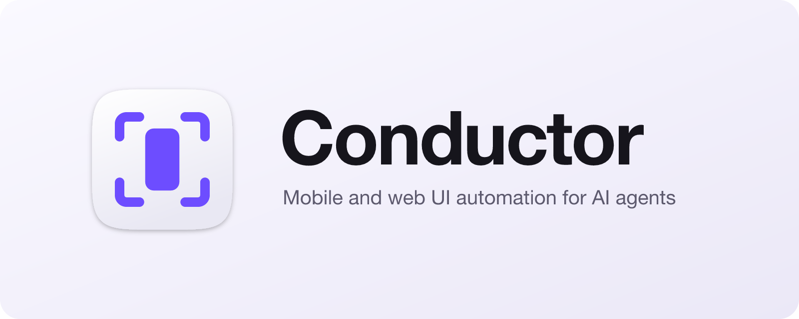
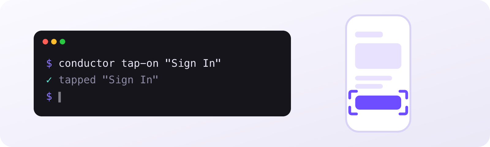
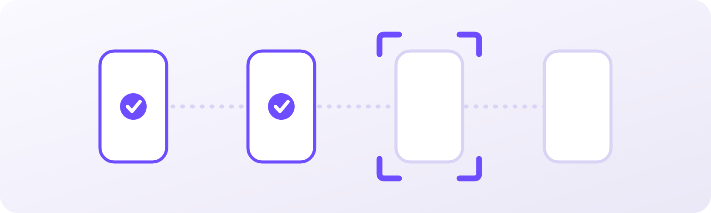

<div align="center">

<picture>
  <source media="(prefers-color-scheme: dark)" srcset="assets/banner-dark.png" />
  
</picture>

### Let your coding agent see and drive the app it's building.

Conductor is a CLI that gives AI agents hands and eyes on a running app. Tap, type, read the live UI, take screenshots and run test flows on iOS, Android, TV, macOS and the web, across as many devices as you have.

[](https://github.com/DouweBos/conductor/actions/workflows/ci.yml)
[](https://www.npmjs.com/package/@houwert/conductor)
[](LICENSE)

[**Quick start**](#quick-start) · [**Docs**](https://houwert.dev/conductor/docs) · [**Conductor Studio**](#conductor-studio) · [**Releases**](https://github.com/DouweBos/conductor/releases)

</div>

---

## Why Conductor

- **Built for agents.** Compact, token-efficient output an agent can act on. One `conductor init` teaches Claude Code the whole CLI through bundled skills.
- **Every screen you ship to.** iOS and tvOS, macOS, Android, Fire TV, Roku and the web, all driven with the same commands.
- **Nothing else to install.** Conductor ships its own native drivers: no Maestro CLI, no JVM, no external service.
- **Your Maestro flows still work.** A TypeScript reimplementation and partial fork of [Maestro](https://maestro.mobile.dev); most existing YAML flows run unchanged.
- **Parallel by default.** Named sessions and a shared device pool let several agents drive several devices at once without stepping on each other.
- **Stays on your machine.** No telemetry, no analytics, no phone-home.

## What your agent can do

<picture>
  <source media="(prefers-color-scheme: dark)" srcset="assets/section-cli-dark.png" />
  
</picture>

An agent works an app the way you do: act, look at the result, act again. It can operate the app while it writes the code for it.

```bash
conductor launch-app com.example.myapp
conductor tap-on "Sign In"
conductor input-text "user@example.com"
conductor assert-visible "Dashboard"
conductor take-screenshot --output /tmp/screen.png
```

| Capability | Commands |
|---|---|
| App lifecycle | `launch-app`, `stop-app`, `clear-state`, `install-app`, `uninstall-app`, `foreground-app`, `copy-app`, `download-app` |
| Interaction | `tap-on`, `input-text`, `scroll`, `scroll-until-visible`, `swipe`, `gesture`, `pinch`, `press-key`, `erase-text`, `hide-keyboard` |
| Inspection | `inspect`, `focused`, `capture-ui`, `take-screenshot`, `list-apps` |
| Assertions | `assert-visible`, `assert-not-visible`, `assert-true`, `assert-screenshot` |
| Navigation | `open-link`, `back` |
| Flows | `run-flow`, `run-flow-inline`, `run-parallel`, `run-sequence`, `flow` |
| Devices | `start-device`, `stop-device`, `list-devices`, `device-pool`, `set-location`, `set-orientation`, `set-permissions` |
| Debugging | `logs`, `crashes`, `network`, `memory`, `profile`, `metro`, `record-video`, `stream-server` |
| In-process (iOS/tvOS) | `native-inspect`, `native-find`, `native-set`, `native-eval`, `native-heap`, and more |
| Test cases | `cases` |
| Web setup | `install-web [browser]` (installs a Playwright browser; `--check` prints status) |
| Discovery | `list-options [command]` / `<command> --options`, `workspace` |

The [command catalogue](https://houwert.dev/conductor/docs/commands) covers each one, and `conductor <command> --help` lists every flag.

## Quick start

```bash
npm install -g @houwert/conductor
conductor init
```

`init` installs Conductor's Claude Code skills into your repository (`.claude/skills/`), so your agent knows every command and the act → observe → act loop. It's the only setup step. In a terminal it asks which skills to install and where; headless, in CI or from an agent, it installs them all.

```bash
conductor init --yes      # install every skill, no prompts
conductor init --global   # install into ~/.claude/skills/ for all repos
conductor init --force    # re-sync after upgrading conductor
```

The skills are `conductor-device-interact`, `conductor-inspect`, `conductor-create-flow`, `conductor-native`, `conductor-metro-debugger`, `conductor-profiler` and `conductor-device-setup`. `init` records the version it installed, so it can tell you when they're stale and prune skills that are no longer shipped. Prefer your own `CLAUDE.md` or a slash command? That works just as well.

New to Conductor? [Getting started](https://houwert.dev/conductor/docs/getting-started) goes from install to your first command in under a minute.

## Conductor Studio

<picture>
  <source media="(prefers-color-scheme: dark)" srcset="assets/section-studio-dark.png" />
  
</picture>

**Write, run and track UI tests, by hand or with an agent.** [Conductor Studio](apps/studio) is a desktop app built on the CLI.

- **A Maestro workbench.** A flow editor with autocomplete and linting, find usages, and renames that repoint every caller.
- **A live device beside your code.** Stream the screen, pick elements, and record your taps into flow steps.
- **Agentic testing.** Describe a behaviour in a sentence. An agent plans the test, drives the device, and files a visual report with evidence for every expectation.
- **Test cases.** See your Qase cases alongside the flows that cover them.

Studio bundles its own copy of the CLI, so there's nothing else to install. It comes in light and dark, and it's signed, notarized and auto-updating.

**[Download for macOS](https://github.com/DouweBos/conductor/releases)** (Apple silicon). Studio releases are tagged `studio-v*`. The [Studio README](apps/studio/README.md) has the full feature tour.

## Platforms

| Platform | Targets |
|---|---|
| iOS & tvOS | Simulators and physical devices |
| macOS | Apps on the host Mac |
| Android | Emulators and devices |
| TV | Amazon Fire TV, Roku |
| Web | Chromium, Firefox and WebKit, via Playwright |

You'll need Xcode for iOS and tvOS, `adb` on your `PATH` for Android, and a Playwright browser for the web (`conductor install-web`).

## Contributing

Issues and pull requests are welcome. [CONTRIBUTING.md](CONTRIBUTING.md) covers the repository layout, building the drivers and CLI from source, and running the tests.

## License

[MIT](LICENSE). Conductor includes code derived from Maestro, licensed under Apache 2.0; see [NOTICE](NOTICE).
